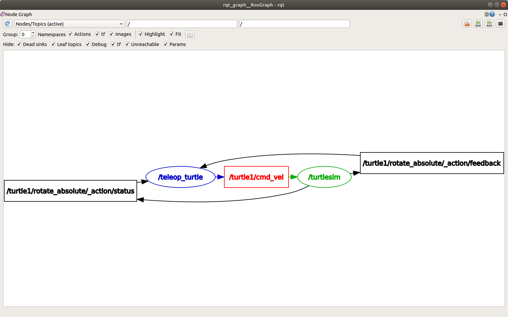

# 11장 ROS 2 토픽

> **참고**: [ROS 2 Jazzy 공식 튜토리얼 - Understanding topics](https://docs.ros.org/en/jazzy/Tutorials/Beginner-CLI-Tools/Understanding-ROS2-Topics/Understanding-ROS2-Topics.html) 기반으로 작성

## 11.1 개요

토픽(Topic)은 ROS 2에서 **가장 기본적이고 빈번하게 사용되는 통신 방식**이다.  
퍼블리셔-서브스크라이버(Pub/Sub) 패턴을 사용하며, 센서 데이터, 제어 명령 등  
연속적으로 흐르는 데이터를 전달하는 데 적합하다.

> 📌 **공식 문서**: "Topics are a vital element of the ROS graph that act as a bus for nodes to exchange messages. A node may publish data to any number of topics and simultaneously have subscriptions to any number of topics."

---

## 11.2 토픽 통신의 구조

### 11.2.1 퍼블리셔와 서브스크라이버

**단일 퍼블리셔 – 단일 서브스크라이버:**


**다중 퍼블리셔 – 다중 서브스크라이버:**


- **퍼블리셔 (Publisher)**: 특정 토픽에 메시지를 발행하는 역할
- **서브스크라이버 (Subscriber)**: 특정 토픽에서 메시지를 수신하는 역할
- **토픽 (Topic)**: 퍼블리셔와 서브스크라이버를 연결하는 이름 있는 채널

### 11.2.2 토픽 통신의 특성

| 특성 | 설명 |
|------|------|
| 비동기 | 발행자와 수신자가 동시에 실행될 필요 없음 |
| 단방향 | 퍼블리셔 → 서브스크라이버 방향의 데이터 흐름 |
| N:N 관계 | 하나의 토픽에 여러 퍼블리셔와 여러 서브스크라이버 가능 |
| 메시지 타입 고정 | 토픽마다 하나의 메시지 타입을 사용 |
| 느슨한 결합 | 퍼블리셔와 서브스크라이버가 서로를 직접 알 필요 없음 |

> 📌 **공식 문서**: "Topics don't have to only be one-to-one communication; they can be one-to-many, many-to-one, or many-to-many."

---

## 11.3 퍼블리셔 구현 (Python)

### 기본 퍼블리셔 노드

```python
import rclpy
from rclpy.node import Node
from std_msgs.msg import String

class MinimalPublisher(Node):
    def __init__(self):
        super().__init__('minimal_publisher')
        # 퍼블리셔 생성: 메시지 타입, 토픽 이름, QoS depth
        self.publisher_ = self.create_publisher(String, '/chatter', 10)
        # 0.5초 주기의 타이머 생성
        self.timer = self.create_timer(0.5, self.timer_callback)
        self.count = 0

    def timer_callback(self):
        msg = String()
        msg.data = f'Hello ROS 2: {self.count}'
        self.publisher_.publish(msg)
        self.get_logger().info(f'발행: "{msg.data}"')
        self.count += 1

def main(args=None):
    rclpy.init(args=args)
    node = MinimalPublisher()
    rclpy.spin(node)
    node.destroy_node()
    rclpy.shutdown()

if __name__ == '__main__':
    main()
```

---

## 11.4 서브스크라이버 구현 (Python)

### 기본 서브스크라이버 노드

```python
import rclpy
from rclpy.node import Node
from std_msgs.msg import String

class MinimalSubscriber(Node):
    def __init__(self):
        super().__init__('minimal_subscriber')
        # 서브스크라이버 생성: 메시지 타입, 토픽 이름, 콜백 함수, QoS depth
        self.subscription = self.create_subscription(
            String,
            '/chatter',
            self.listener_callback,
            10
        )

    def listener_callback(self, msg):
        self.get_logger().info(f'수신: "{msg.data}"')

def main(args=None):
    rclpy.init(args=args)
    node = MinimalSubscriber()
    rclpy.spin(node)
    node.destroy_node()
    rclpy.shutdown()

if __name__ == '__main__':
    main()
```

---

## 11.5 퍼블리셔 구현 (C++)

### 기본 퍼블리셔 노드

```cpp
#include "rclcpp/rclcpp.hpp"
#include "std_msgs/msg/string.hpp"

class MinimalPublisher : public rclcpp::Node {
public:
    MinimalPublisher() : Node("minimal_publisher"), count_(0) {
        publisher_ = this->create_publisher<std_msgs::msg::String>("/chatter", 10);
        timer_ = this->create_wall_timer(
            std::chrono::milliseconds(500),
            std::bind(&MinimalPublisher::timer_callback, this)
        );
    }

private:
    void timer_callback() {
        auto message = std_msgs::msg::String();
        message.data = "Hello ROS 2: " + std::to_string(count_++);
        publisher_->publish(message);
        RCLCPP_INFO(this->get_logger(), "발행: '%s'", message.data.c_str());
    }
    rclcpp::Publisher<std_msgs::msg::String>::SharedPtr publisher_;
    rclcpp::TimerBase::SharedPtr timer_;
    size_t count_;
};

int main(int argc, char *argv[]) {
    rclcpp::init(argc, argv);
    rclcpp::spin(std::make_shared<MinimalPublisher>());
    rclcpp::shutdown();
    return 0;
}
```

---

## 11.6 서브스크라이버 구현 (C++)

### 기본 서브스크라이버 노드

```cpp
#include "rclcpp/rclcpp.hpp"
#include "std_msgs/msg/string.hpp"

class MinimalSubscriber : public rclcpp::Node {
public:
    MinimalSubscriber() : Node("minimal_subscriber") {
        subscription_ = this->create_subscription<std_msgs::msg::String>(
            "/chatter", 10,
            std::bind(&MinimalSubscriber::topic_callback, this, std::placeholders::_1)
        );
    }

private:
    void topic_callback(const std_msgs::msg::String::SharedPtr msg) {
        RCLCPP_INFO(this->get_logger(), "수신: '%s'", msg->data.c_str());
    }
    rclcpp::Subscription<std_msgs::msg::String>::SharedPtr subscription_;
};

int main(int argc, char *argv[]) {
    rclcpp::init(argc, argv);
    rclcpp::spin(std::make_shared<MinimalSubscriber>());
    rclcpp::shutdown();
    return 0;
}
```

---

## 11.7 ros2 topic 명령어

토픽을 확인하고 디버깅하기 위한 명령어들이다.

### 주요 명령어

```bash
# 현재 활성화된 토픽 목록
ros2 topic list

# 토픽 목록 + 메시지 타입 함께 표시
ros2 topic list -t
```

**turtlesim 실행 시 출력 예시:**
```
/parameter_events [rcl_interfaces/msg/ParameterEvent]
/rosout [rcl_interfaces/msg/Log]
/turtle1/cmd_vel [geometry_msgs/msg/Twist]
/turtle1/color_sensor [turtlesim/msg/Color]
/turtle1/pose [turtlesim/msg/Pose]
```

```bash
# 특정 토픽의 상세 정보
ros2 topic info /turtle1/cmd_vel
```

**출력:**
```
Type: geometry_msgs/msg/Twist
Publisher count: 1
Subscription count: 1
```

```bash
# 상세 QoS 정보 포함
ros2 topic info /turtle1/cmd_vel --verbose
```

**출력 (QoS 프로파일 포함):**
```
Type: geometry_msgs/msg/Twist

Publisher count: 1
  Node name: teleop_turtle
  Node namespace: /
  QoS profile:
    Reliability: RELIABLE
    History (Depth): KEEP_LAST (7)
    Durability: VOLATILE

Subscription count: 1
  Node name: turtlesim
  Node namespace: /
  QoS profile:
    Reliability: RELIABLE
    History (Depth): KEEP_LAST (7)
    Durability: VOLATILE
```

```bash
# 토픽 데이터를 터미널에서 실시간 확인
ros2 topic echo /turtle1/cmd_vel
```

**거북이를 방향키로 움직이면 출력:**
```
linear:
  x: 2.0
  y: 0.0
  z: 0.0
angular:
  x: 0.0
  y: 0.0
  z: 0.0
---
```

```bash
# 토픽의 발행 빈도(Hz) 측정
ros2 topic hz /turtle1/pose

# 토픽의 대역폭(bandwidth) 측정
ros2 topic bw /turtle1/pose

# 특정 메시지 타입을 사용하는 토픽 찾기
ros2 topic find geometry_msgs/msg/Twist

# 명령줄에서 직접 토픽에 메시지 발행
ros2 topic pub /turtle1/cmd_vel geometry_msgs/msg/Twist \
  "{linear: {x: 2.0, y: 0.0, z: 0.0}, angular: {x: 0.0, y: 0.0, z: 1.8}}"

# 1회만 발행 (--once), 구독자 2개 연결 대기 (-w 2)
ros2 topic pub --once -w 2 /turtle1/cmd_vel geometry_msgs/msg/Twist \
  "{linear: {x: 2.0}, angular: {z: 1.8}}"

# 빈 메시지 발행 (기본값으로 1Hz 발행)
ros2 topic pub /turtle1/cmd_vel geometry_msgs/msg/Twist
```

> 💡 **Tip**: 메시지의 모든 필드를 지정할 필요 없다. 변경하고 싶은 값만 지정하면 나머지는 기본값(0)이 적용된다.  
> 예: `"{linear: {x: 2.0}, angular: {z: 1.8}}"` — 나머지 필드는 자동으로 0.0

### 명령어 정리

| 명령어 | 기능 |
|--------|------|
| `ros2 topic list` | 토픽 목록 조회 |
| `ros2 topic list -t` | 토픽 목록 + 메시지 타입 |
| `ros2 topic info` | 토픽 상세 정보 (퍼블리셔/서브스크라이버 수, 타입) |
| `ros2 topic info --verbose` | 토픽 상세 정보 + QoS 프로파일 |
| `ros2 topic echo` | 토픽 메시지 실시간 모니터링 |
| `ros2 topic hz` | 메시지 발행 주파수 측정 |
| `ros2 topic bw` | 메시지 대역폭 측정 |
| `ros2 topic find` | 특정 메시지 타입의 토픽 검색 |
| `ros2 topic pub` | 명령줄에서 메시지 발행 |
| `ros2 interface show` | 메시지 타입 구조 확인 |

---

## 11.8 실습: turtlesim과 토픽

turtlesim을 활용한 토픽 통신 실습 과정이다.

### 실습 순서

```bash
# 1. turtlesim 노드 실행
ros2 run turtlesim turtlesim_node

# 2. 키보드 조종 노드 실행 (다른 터미널)
ros2 run turtlesim turtle_teleop_key

# 3. 토픽 목록 확인 (다른 터미널)
ros2 topic list -t

# 4. 거북이 위치 정보 확인
ros2 topic echo /turtle1/pose

# 5. 거북이 이동 명령 토픽 확인
ros2 topic echo /turtle1/cmd_vel

# 6. 명령줄에서 직접 거북이 원 그리기 (연속 발행)
ros2 topic pub /turtle1/cmd_vel geometry_msgs/msg/Twist \
  "{linear: {x: 2.0}, angular: {z: 1.8}}"

# 7. 발행 주파수 확인
ros2 topic hz /turtle1/pose
```

### turtlesim 주요 토픽

| 토픽 이름 | 메시지 타입 | 설명 |
|-----------|------------|------|
| `/turtle1/cmd_vel` | `geometry_msgs/msg/Twist` | 거북이 이동 명령 (선속도/각속도) |
| `/turtle1/pose` | `turtlesim/msg/Pose` | 거북이 현재 위치(x, y, theta, 속도) |
| `/turtle1/color_sensor` | `turtlesim/msg/Color` | 거북이 발 아래 배경 색상 |
| `/parameter_events` | `rcl_interfaces/msg/ParameterEvent` | 파라미터 변경 이벤트 |
| `/rosout` | `rcl_interfaces/msg/Log` | 노드 로그 메시지 |

---

## 11.9 토픽 시각화 — rqt_graph

`rqt_graph`를 사용하면 현재 시스템의 노드와 토픽 연결 관계를 **그래프로 시각화**할 수 있다.

```bash
# rqt_graph 실행
ros2 run rqt_graph rqt_graph
```



위 그래프는 `/teleop_turtle` 노드가 `/turtle1/cmd_vel` 토픽을 통해 `/turtlesim` 노드에 키 입력 데이터를 전달하는 구조를 보여준다.

**rqt_graph에서 확인할 수 있는 정보:**
- 노드 간 토픽 연결 관계
- 퍼블리셔와 서브스크라이버의 관계
- 데이터 흐름 방향
- `ros2 topic echo`로 모니터링 중인 노드도 그래프에 표시됨

> 💡 **Tip**: rqt_graph에서 `Debug` 체크를 해제하면 `/rosout`, `/parameter_events` 같은 내부 토픽이 숨겨져 그래프가 깔끔해진다.

---

## 11.10 QoS와 토픽

토픽 통신에서 QoS(Quality of Service) 설정은 메시지 전달 방식을 결정한다.

### 토픽에서 자주 사용하는 QoS 설정

| 데이터 유형 | 권장 QoS |
|------------|----------|
| 카메라 이미지 | BEST_EFFORT, VOLATILE, Depth 1 |
| 라이다 스캔 | BEST_EFFORT, VOLATILE, Depth 5 |
| 이동 명령 (/cmd_vel) | RELIABLE, VOLATILE, Depth 10 |
| 맵 데이터 | RELIABLE, TRANSIENT_LOCAL, Depth 1 |

### Python에서 QoS 적용

```python
from rclpy.qos import QoSProfile, ReliabilityPolicy, DurabilityPolicy

# 센서 데이터용 QoS
sensor_qos = QoSProfile(
    depth=5,
    reliability=ReliabilityPolicy.BEST_EFFORT,
    durability=DurabilityPolicy.VOLATILE,
)

# 이 QoS를 사용하여 서브스크라이버 생성
self.subscription = self.create_subscription(
    LaserScan, '/scan', self.scan_callback, sensor_qos
)
```

### `ros2 topic info --verbose`로 QoS 확인

```bash
ros2 topic info /turtle1/cmd_vel --verbose
```

위 명령어로 실행 중인 퍼블리셔와 서브스크라이버의 **QoS 프로파일을 실시간으로 확인**할 수 있다.  
QoS가 호환되지 않으면 토픽이 연결되지 않으므로, 문제 발생 시 반드시 확인해야 한다.

---

## 11.11 정리

ROS 2 토픽의 핵심 내용을 요약하면 다음과 같다.

| 항목 | 설명 |
|------|------|
| 토픽 | 비동기 Pub/Sub 패턴의 데이터 채널 |
| 퍼블리셔 | 토픽에 메시지를 발행하는 역할 |
| 서브스크라이버 | 토픽에서 메시지를 수신하고 콜백을 실행 |
| N:N 통신 | 다대다 통신 지원 (one-to-many, many-to-one, many-to-many) |
| 메시지 타입 | `.msg` 파일로 정의된 데이터 구조 |
| `ros2 topic` | 토픽 조회, 모니터링, 발행을 위한 CLI 도구 |
| `ros2 topic info --verbose` | QoS 프로파일까지 포함한 상세 정보 확인 |
| `ros2 topic find` | 특정 메시지 타입의 토픽 검색 |
| rqt_graph | 노드-토픽 연결 관계 시각화 도구 |
| QoS | 토픽별 메시지 전달 방식 제어 |

토픽은 ROS 2에서 가장 많이 사용되는 통신 방식으로,  
센서 데이터 스트리밍부터 제어 명령 전달까지 폭넓게 활용된다.  
퍼블리셔와 서브스크라이버의 구현을 정확히 이해하는 것이 다른 통신 방식(서비스, 액션)을 이해하는 기반이 된다.
